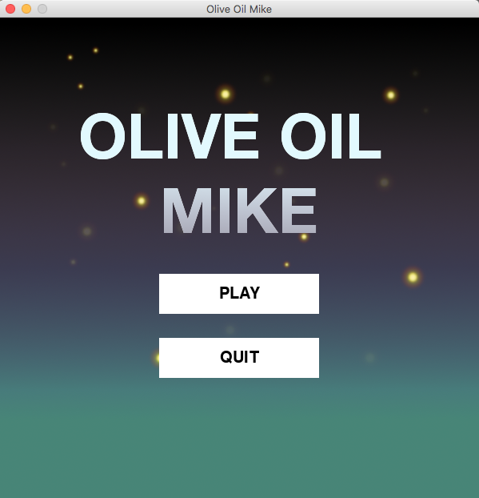
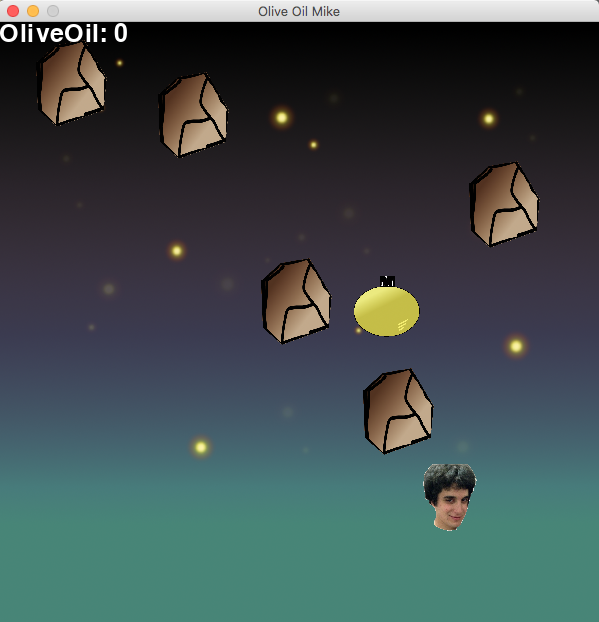

# Olive Oil Mike
2D Python game developed using PyGame package and Python 3.6

All images and background design were custom made and created using Gimp 2.8

## Features
  - Character selection
  - Background Music
  - Shoot oil drop bullets to destroy rocks

## How to Play/Controls
  - Download OO_MikeMain.py and images folder to python working directory
  - Run OO_MikeMain.py
  - Arrow Keys to control the player [up/down/left/right]
  - Intro Screen mouse click to either play or quit the game
  
## Gameplay
  Dodge rocks and collect olive oil containers.
  
## Future updates to incorporate:
  1. Sound clip triggers
  2. High Score module for keeping track of past achievements
  3. Player health bar/multiple lives for continued gameplay
  4. Player powerups and discrete levels
  5. Standalone Windows .exe file

## Screenshots

## Link to PyGame Site
https://www.pygame.org/wiki/GettingStarted

